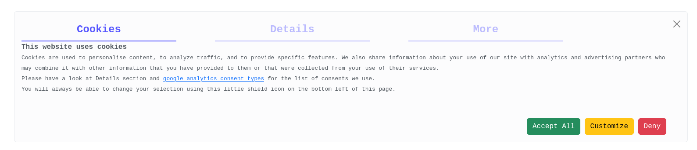

# Flask Cookies

Welcome to Flask-Cookies

This is a python package that we developed to rapidly implement cookie banners within our [Flask](https://flask.palletsprojects.com/en/3.0.x/) based web applications.

This banner deal with cookies following [Google Tag Consent](https://support.google.com/tagmanager/?hl=en#topic=13562736) types, which are thoroughly explained [here](https://support.google.com/tagmanager/?hl=en#topic=) and in several other guides.

Basically, if you want to, you can easily connect your [Google Tag Manager](https://tagmanager.google.com/) account to the banner, and directly work on consent and actions from your GTM console, with all the advantages and functionalities it offers.

Flask-Cookies is extremely easy to install and immediately takes up the banner for you in your Flask application.

Here is how then banner looks: 

You can also have a look at a live example of the banner [here](https://flask-cookies-rpreview.tiiny.site)

Please note: as we collapsed the whole thing in a single HTML document for this [live example](https://flask-cookies-rpreview.tiiny.site/), * *in some browser it might have some rendering problem* *. It should work on Firefox, Safari, Chrome, etc.

You have different options to install `Flask-Cookies`:
1. Python installation (the easiest way)
2. Flask-Cookies installer
3. Manual installation

## 1. Python installation
Now, installation of Flask-Cookies can be easily done directly through [pip](https://pypi.org/project/pip/):
```
pip install flask-cookies
```
then you simply import it in your app initialization. Your app structure should be something similar to:
```
app
└── __init__.py
└── ... rest of files ...
```
Simply add these lines into your app `__init__.py` file:
```
from flask_cookies import Cookies

cookies = Cookies(<put-your-GTM-ID-here>)

app = Flask(__name__)
cookies.init_app(app)
### rest of your app configuration
```
And that's all!

Now you can simply import the `Flask-Cookies` template from your base application template (the one that you extend in the rest of application templates, have a look [here](https://blog.miguelgrinberg.com/post/the-flask-mega-tutorial-part-ii-templates) if you don't know what I'm talking about: it will change your life):
```

```

And you are completely set! Next time you run your application you have your nice cookie banner on it and directly connected with your Google Tag Manager account, from which you can easily manage and implement consent thorough your website without needing additional code modifications (have a look [here](https://support.google.com/tagmanager/answer/10718549?hl=en) to have an idea of how powerful GTM is)

## 2. Flask-Cookies Installer
As you download `Flask-Cookies` you get a `installer.sh` file ([here](installer.sh)) which you can easily run in a `bash` shell with:
```
bash installer.sh \
    --app-dir <flask-app-dir>
    --gtm-id <your-GTM-ID>
```
You need to specify these two options above:
1. `--app-dir`: the full path to your flask application directly
2. `--gtm-id`: your Google Tag Manager ID
***important***: the installer assumes that your application structure is:
```
app
└── __init__.py
└── static/
└── templates/
```
as it will copy `Flask-Cookies` files in these two folders. Be sure it matches.
In case your application structure is different it will simply abort the installation.

The installer will put your GTM ID into needed fields, so you simply need to import the `Flask-Cookies` template from your base application template (the one that you extend in the rest of your application templates):
```

```
and you will have your cookie banner connected with your GTM account all set up

## 3. Manual Installation
You can manually install the files in needed positions. You simply need to:
- copy `cookies.html` into your app `templates/` folder
- copy `cookies.css` and `cookies-logo.png` into your app `static/` folder
You will also need to replace `YOUR_GTM_ID` into `cookies.html` with your actual GTM ID in order to connect to it.
Then you simply import this template from your base app template:
```

```
And everything is set up and working!


Feel free to use `Flask-Cookies` and all your applications and to modify its files as you need (but share with us improvements so we can share them with the world).
